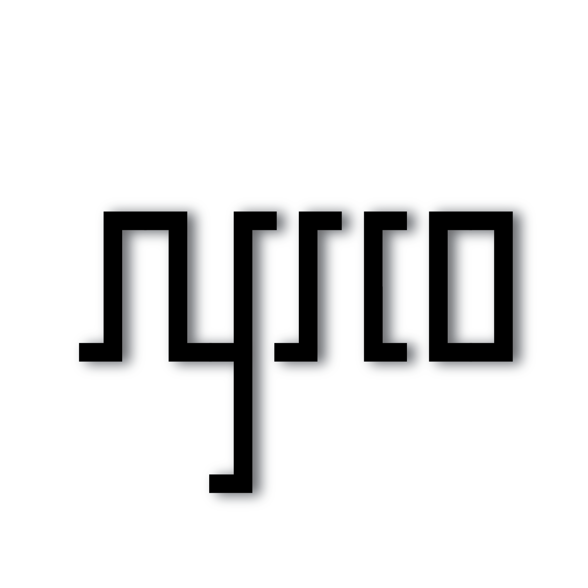
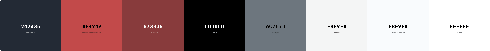
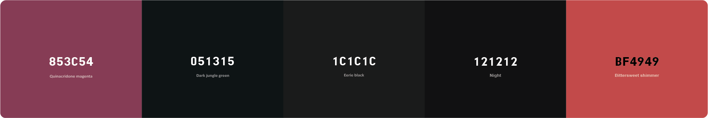
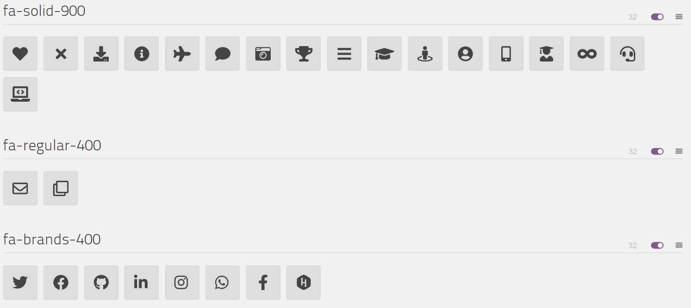

<h1 align="center">
        <a href="https://syyysco.github.io/">syyysco.github.io</a> - v2.0
        <p align="center">
                
                
                
                
                
                
                
                
                
        </p>
</h1>

<br/>

<div align="center">
        <a href="https://github.com/Syyysco/syyysco.github.io">
                
        </a>
        <h3 align="center">Jose Francisco López (Sysco)'s Personal Portfolio</h3>
        <p align="center">
                This is the source code for my Personal Portfolio.
                <br/>
                <a href="https://github.com/Syyysco/syyysco.github.io"><strong>Explore the docs »</strong></a>
                <br/>
                <br/>
                <a href="https://syyysco.github.io/">View Demo</a>
                ·
                <a href="https://github.com/Syyysco/syyysco.github.io/issues/new?assignees=Syyysco&labels=bug&template=bug_report.yml&title=%5BBUG%5D%3A+">Report Bug</a>
                ·
                <a href="https://github.com/Syyysco/syyysco.github.io/issues/new?assignees=&labels=enhancement&template=feature_request.yml&title=%5BFEAT%5D%3A+">Request Feature</a>
        </p>
        <p>
                 •
                
        </p>
		<p>
                
        </p>
</div>

<br/>

<p align="center">
  <a href="https://syyysco.github.io/">
    
  </a>
</p>

<br>

## Table of Contents :scroll:

- [Design](#design-art)
    - [Fonts](#fonts)
    - [Color Scheme](#color-scheme)
    - [Icon](#icon)
- [Built With](#built-with-package)
- [How to Run or deploy?](#how-to-run-or-deploy-dart)
- [Sections](#sections-bookmark)
- [Folder Structure](#folder-structure-open_file_folder)
- [Search engine optimization(SEO)](#search-engine-optimizationseo-spider)
- [PageSpeed Insights](#pagespeed-insights)
- [Creator / Maintainer](#creator--maintainer-man_technologist)
- [Contributing](#-contributing)
- [License](#-license)

<br>

## Design :art:

### Fonts

[Pixelogist](https://www.dafont.com/pixelogist.font) - Text Style


---

### Color Scheme

#### Main Screen

- **Gunmetal** - Primary theme color
- **Bittersweet shimmer** - Secondary theme color
- **Cordovan** - Scroll Bar Handler Hover
- **Eerie Black** - Dark Text Color
- **Slate Gray** - Muted Text Color
- **Seasalt** - Text Color
- **Anti-Flash White** - Scroll Bar Color
- **White** - Background

<a href="https://coolors.co/242a35-ff9800-212529-6c757d-ffffff-f8f9fa-ecd9bc">
  
</a>

<br/>
<br/>

#### Splash Screen & 404 Page

- **Quinacridone Magenta** - Inner Splash Circle color
- **Eerie Black** - Background Color of Splash Screen
- **Dark Jungle Green** - 404 Text Color
- **Night** - Shadows of splash circles
- **Bittersweet Shimmer** - Outer Splash Circle color

<a href="https://coolors.co/090909-121212-ffff00-03a9f4-011718">
  
</a>

---

### Icon

This is the icon of me in [syyysco.github.io](https://syyysco.github.io)


Insert the following code in the `<head>` section of your pages to support favicons on all browsers and platforms.

```html
<meta name="theme-color" content="#242a35">
<link rel="manifest" href="manifest.webmanifest">
<link rel="icon" type="image/png" sizes="16x16" href="favicon-16x16.png">
<link rel="icon" type="image/png" sizes="32x32" href="favicon-32x32.png">
<link rel="apple-touch-icon" sizes="180x180" href="apple-touch-icon.png">
<link rel="mask-icon" href="assets/images/safari-pinned-tab.svg" color="#242a35">
<meta name="msapplication-TileColor" content="#242a35">
<meta name="msapplication-TileImage" content="assets/images/mstile-70x70.png">
<meta name="msapplication-TileImage" content="assets/images/mstile-144x144.png">
<meta name="msapplication-TileImage" content="assets/images/mstile-150x150.png">
<meta name="msapplication-TileImage" content="assets/images/mstile-310x150.png">
<meta name="msapplication-TileImage" content="assets/images/mstile-310x310.png">
```

Results :- [100%](https://realfavicongenerator.net/favicon_checker?protocol=https&site=syyysco.github.io)

These are the Font Awesome Icons used in [syyysco.github.io](https://syyysco.github.io)



<br>

## Built With :package:

- 💙 [HTML5](https://www.w3schools.com/html/)
- 💜 [CSS3](https://www.w3schools.com/css/)
- 💙 [JavaScript](https://www.w3schools.com/js/DEFAULT.asp)
- 💜 [TypeScript](https://www.typescriptlang.org/)
- 💙 [Angular](https://angular.io/)
- 💜 [NodeJS](https://nodejs.org/)
- 💙 [Bootstrap](https://getbootstrap.com/)
- 💜 [Dafont](https://www.dafont.com/) for the fonts
- 💙 [FontAwesome](https://fontawesome.com/) for the icons
- 💜 [GitHub Pages](https://pages.github.com/) for hosting

<br>

## How to run or deploy? :dart:

Make sure you have [Node](https://nodejs.org/en/) and [git](https://git-scm.com/) installed.

  ```bash
  node --version
  git --version
  ```

- Clone the repository :
        - With HTTPS:
          ```bash
          git clone https://github.com/Syyysco/syyysco.github.io.git
          ```
        - With SSH:
          ```bash
          git@github.com:Syyysco/syyysco.github.io.git
          ```

- Navigate to working Directory and **main** branch

  ```bash
  cd syyysco.github.io
  git switch main
  ```

- Install the dependencies:

  ```bash
  npm install -f
  ```
        - Installs all the dependencies required by the project.


- Fire up a development server:

  ```bash
  ng serve
  ```
        - Runs the app in the `development` mode.
        - Open [http://localhost:4200/](http://localhost:4200/) to view it in the Default Browser.
        - The page will reload if you make edits.
        - You will also see any lint errors in the console.


- Deploy code to GitHub Pages (gh-pages):

  ```bash
  ng deploy --base-href="/"
  ```
        - Builds the application for production to the `build` folder & deploys application on `GitHub Pages`.
        - It correctly bundles Angular in production mode and optimizes the build for the best performance.
        - The build is minified and the filenames include the hashes.


- Create a new branch:

  ```bash
  git checkout -b "<NAME-OF-THE-BRANCH>"
  ```

- Add, Commit & Push the local changes to remote repository:

  ```bash
  git add .
  git commit -m "<COMMIT-MESSAGE>"
  git push origin <NAME-OF-THE-BRANCH>
  ```

**For Docker Users**

Make sure you have [Docker](https://www.docker.com/products/docker-desktop/) installed.

```bash
docker --version
```

- To pull the [GitHub Container Registry](https://github.com/Syyysco/syyysco.github.io/pkgs/container/syyysco.github.io) Image:
  ```bash
  docker pull ghcr.io/syyysco/syyysco.github.io:latest
  ```

- To pull the [Dockerhub](https://hub.docker.com/r/syyysco/syyysco.github.io) Image:
  ```bash
  docker pull syyysco/syyysco.github.io:latest
  ```

- To automatically pull and run the [GitHub Container Registry](https://github.com/Syyysco/syyysco.github.io/pkgs/container/syyysco.github.io) Image:
  ```bash
  docker run -d -p 4200:80 ghcr.io/syyysco/syyysco.github.io:latest
  ```

- To automatically pull and run the [Dockerhub](https://hub.docker.com/r/syyysco/syyysco.github.io) Image:
  ```bash
  docker run -d -p 4200:80 syyysco/syyysco.github.io:latest
  ```

  Open [http://localhost:4200/](http://localhost:4200/) to view it in the Default Browser.

<br>

## Sections :bookmark:

- Home
- About
        - About
        - Skill
        - Education
- Portfolio
- Training
- Achievement
- Contact

<br>

## Folder Structure :open_file_folder:

<pre>

|   372.XXXXXXXXXXXXXXXX.js
|   3rdpartylicenses.txt
|   404.XXXXXXXXXXXXXXXX.webp
|   404.html
|   478.XXXXXXXXXXXXXXXX.js
|   about-bg.XXXXXXXXXXXXXXXX.svg
|   apple-touch-icon.png
|   bgimg.XXXXXXXXXXXXXXXX.webp
|   browserconfig.xml
|   fa-brands-400.XXXXXXXXXXXXXXXX.woff2
|   fa-brands-400.XXXXXXXXXXXXXXXX.woff
|   fa-brands-400.XXXXXXXXXXXXXXXX.eot
|   fa-brands-400.XXXXXXXXXXXXXXXX.svg
|   fa-brands-400.XXXXXXXXXXXXXXXX.ttf
|   fa-regular-400.XXXXXXXXXXXXXXXX.ttf
|   fa-regular-400.XXXXXXXXXXXXXXXX.woff2
|   fa-regular-400.XXXXXXXXXXXXXXXX.eot
|   fa-regular-400.XXXXXXXXXXXXXXXX.woff
|   fa-regular-400.XXXXXXXXXXXXXXXX.svg
|   fa-solid-900.XXXXXXXXXXXXXXXX.woff2
|   fa-solid-900.XXXXXXXXXXXXXXXX.woff
|   fa-solid-900.XXXXXXXXXXXXXXXX.ttf
|   fa-solid-900.XXXXXXXXXXXXXXXX.svg
|   fa-solid-900.XXXXXXXXXXXXXXXX.eot
|   favicon-16x16.png
|   favicon-32x32.png
|   favicon.ico
|   index.html
|   LICENSE
|   main.XXXXXXXXXXXXXXXX.js
|   manifest.webmanifest
|   ngsw-worker.js
|   ngsw.json
|   polyfills.XXXXXXXXXXXXXXXX.js
|   quote-img.XXXXXXXXXXXXXXXX.webp
|   README.md
|   robots.txt
|   runtime.XXXXXXXXXXXXXXXX.js
|   safety-worker.js
|   scripts.XXXXXXXXXXXXXXXX.js
|   sitemap_index.xml
|   styles.XXXXXXXXXXXXXXXX.css
|   worker-basic.min.js
|
+---assets
|   |   data.min.js
|   |
|   +---css
|   |       animate.min.css
|   |       font-awesome.min.css
|   |
|   +---fonts
|   |       BlackOpsOne.eot
|   |       BlackOpsOne.svg
|   |       BlackOpsOne.ttf
|   |       BlackOpsOne.woff
|   |       BlackOpsOne.woff2
|   |       fa-brands-400.eot
|   |       fa-brands-400.svg
|   |       fa-brands-400.ttf
|   |       fa-brands-400.woff
|   |       fa-brands-400.woff2
|   |       fa-regular-400.eot
|   |       fa-regular-400.svg
|   |       fa-regular-400.ttf
|   |       fa-regular-400.woff
|   |       fa-regular-400.woff2
|   |       fa-solid-900.eot
|   |       fa-solid-900.svg
|   |       fa-solid-900.ttf
|   |       fa-solid-900.woff
|   |       fa-solid-900.woff2
|   |
|   +---images
|   |   |   404.webp
|   |   |   about-bg.svg
|   |   |   bgimg.webp
|   |   |   footer-cloud.svg
|   |   |   frame-desktop.webp
|   |   |   frame-mobile.webp
|   |   |   monkey.webp
|   |   |   moon-dark.svg
|   |   |   moon.svg
|   |   |   mstile-144x144.png
|   |   |   mstile-150x150.png
|   |   |   mstile-310x150.png
|   |   |   mstile-310x310.png
|   |   |   mstile-70x70.png
|   |   |   og-image.jpg
|   |   |   Profile-pic-144x144.png
|   |   |   Profile-pic-192x192.png
|   |   |   Profile-pic-384x384.png
|   |   |   Profile-pic-512x512.png
|   |   |   Profile-pic.webp
|   |   |   quote-img.webp
|   |   |   safari-pinned-tab.svg
|   |   |
|   |   +---achievement
|   |   |       EthicalHacking.webp
|   |   |       HackerRank.webp
|   |   |       Hacktoberfest.webp
|   |   |
|   |   \---portfolio
|   |           Comming-Soon.webp
|   |           Zeven.webp
|   |
|   +---js
|   |       live2d.min.js
|   |       particles.min.js
|   |       vanilla-tilt.min.js
|   |       wow.min.js
|   |
|   \---<a href="/assets/model/">model</a>
|
\---screenshots
        color-loader-404.png
        color-main.png
        font-awesome-icon.png
        font.png
        icon.png
        PageSpeedInsight Desktop.png
        PageSpeedInsight Mobile.png
        screenshot-portrait.png
</pre>

<br>

## Search engine optimization(SEO) :spider:

Search engine optimization (SEO) is the process of improving the quality and quantity of website traffic to a website or a web page from search engines.
Add the below code snippet to `index.html` with your site info. This step is not mandatory.

```html
<meta itemprop="name" content="--- YOUR TITLE ---">
<meta itemprop="description" content="--- SITE DESCRIPTION ---">
<meta itemprop="url" content="--- YOUR SITE URL ---"/>
<meta itemprop="image" content="--- YOUR IMAGE ---">
<link rel="image_src" href="--- YOUR IMAGE ---">

<meta name="author" content="--- YOUR NAME ---">
<meta name="description" content="--- SITE DESCRIPTION ---">
<meta name="keywords" content="--- SITE KEYWORDS ---">

<meta property="og:image" content="--- YOUR IMAGE ---">
<meta property="og:image:width" content="--- YOUR IMAGE WIDTH ---">
<meta property="og:image:height" content="--- YOUR IMAGE HEIGHT ---">
<meta property="og:image:alt" content="--- YOUR TITLE ---">
<meta property="og:title" content="--- YOUR TITLE ---">
<meta property="og:description" content="--- SITE DESCRIPTION ---">
<meta property="og:url" content="--- YOUR SITE URL ---">
<meta property="og:type" content="website">

<meta name="twitter:title" content="--- YOUR TITLE ---">
<meta name="twitter:description" content="--- SITE DESCRIPTION ---">
<meta name="twitter:site" content="@--- YOUR USERNAME ---">
<meta name="twitter:creator" content="@--- YOUR USERNAME ---">
<meta name="twitter:image:src" content="--- YOUR IMAGE ---">
<meta name="twitter:image" content="--- YOUR IMAGE ---">
<meta name="twitter:card" content="summary_large_image">

<script type="application/ld+json">
    {
        "@type": "Person",
        "@context": "https://schema.org",
        "url": "--- YOUR SITE URL ---",
        "description": "--- SITE DESCRIPTION ---",
        "name": "--- YOUR NAME ---",
        "image": "--- YOUR IMAGE ---",
        "email":"--- YOUR EMAIL ---",
        "address": "--- YOUR LOCATION ---",
        "sameAs":[
            "https://github.com/--- YOUR USERNAME ---/",
            "https://www.linkedin.com/in/--- YOUR USERNAME ---/",
            "https://gist.github.com/--- YOUR USERNAME ---/",
            "https://www.hackerrank.com/--- YOUR USERNAME ---",
            "https://www.instagram.com/--- YOUR USERNAME ---/",
            "https://www.facebook.com/--- YOUR USERNAME ---/",
            "https://twitter.com/--- YOUR USERNAME ---/",
            "https://dev.to/--- YOUR USERNAME ---",
            "https://wa.me/--- YOUR MOBILE NUMBER ---"
        ]
    }
</script>
```

<br>

## PageSpeed Insights

PageSpeed Insights (PSI) reports on the performance of a page on both mobile and desktop devices, and provides suggestions on how that page may be improved.

- **Desktop**

  [](https://googlechrome.github.io/lighthouse/viewer/?psiurl=https%3A%2F%2Fsyyysco.github.io%2F&strategy=desktop&category=performance&category=accessibility&category=best-practices&category=seo&category=pwa)

- **Mobile**

  [](https://googlechrome.github.io/lighthouse/viewer/?psiurl=https%3A%2F%2Fsyyysco.github.io%2F&strategy=mobile&category=performance&category=accessibility&category=best-practices&category=seo&category=pwa)

<br>

## Creator / Maintainer :man_technologist:

👤 Jose Francisco Lopez ([Sysco](https://github.com/Syyysco))

If you have any questions, comments, or concerns, feel free to contact me below.

<p align="left">
        <a href="https://www.linkedin.com/in/Sysco">
        	
        </a>
        <a href="mailto:syscodev@proton.me">
            
        </a>
        <a href="https://www.x.com/syyysco">
        	
        </a>
		<a href="https://www.instagram.com/syyysco">
        	
        </a>
</p>

This project was created for educational purposes and for personal use. Feel free to take inspiration.

If you like my content or find this code useful, give it a ⭐.

<br>

## 🤝 Contributing

Contributions, Issues and Feature requests are Welcome!

Feel free to check the [Issues page](https://github.com/Syyysco/syyysco.github.io/issues/).

<br>

## 📝 License

This project is [MIT](https://opensource.org/licenses/MIT) licensed.<br/>
Copyright &copy; 2021 Jose Francisco Lopez. All rights reserved.
